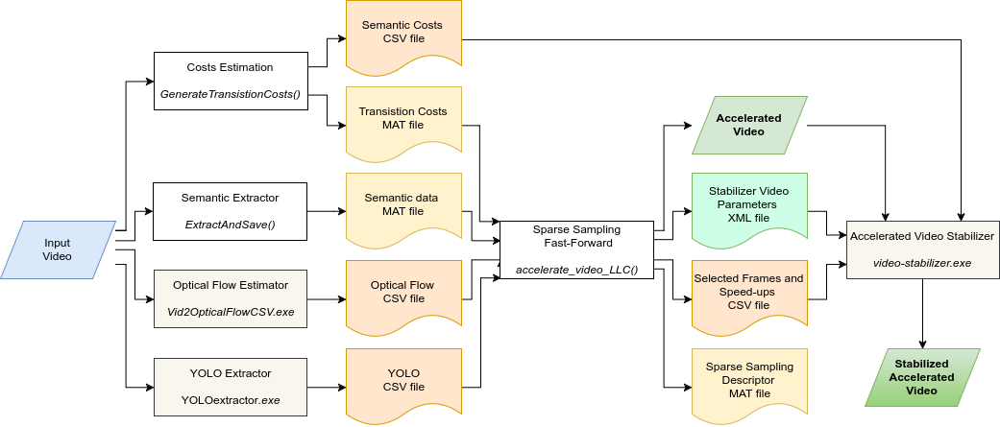

# Sparse Coding Semantic Hyperlapse

[](https://www.verlab.dcc.ufmg.br/semantic-hyperlapse)
[](LICENSE)

# Project #

This project contains the code and data used to generate the results reported in the paper [A Weighted Sparse Sampling and Smoothing Frame Transition Approach for Semantic Fast-Forward First-Person Videos](https://www.verlab.dcc.ufmg.br/semantic-hyperlapse/papers/) on the **IEEE Conference on Computer Vision and Pattern Recognition (CVPR) 2018**. It implements a Semantic Fast-forward method for First-Person Videos with a proper stabilization method based on a adaptive frame selection via Minimum Sparse Reconstruction problem and Smoothing Frame Transition.

For more information and visual results, please access the [project page](https://www.verlab.dcc.ufmg.br/semantic-hyperlapse).

## Contact ##

### Authors ###

* Michel Melo da Silva - PhD student - UFMG - michelms@dcc.ufmg.com
* Washington Luis de Souza Ramos - PhD student - UFMG - washington.ramos@outlook.com
* João Pedro Klock Ferreira - Undergraduate Student - UFMG - jpklock@ufmg.br
* Felipe Cadar Chamone - Undergraduate Student - UFMG - cadar@dcc.ufmg.br
* Mario Fernando Montenegro Campos - Advisor - UFMG - mario@dcc.ufmg.br
* Erickson Rangel do Nascimento - Advisor - UFMG - erickson@dcc.ufmg.br

### Institution ###

Federal University of Minas Gerais (UFMG)  
Computer Science Department  
Belo Horizonte - Minas Gerais -Brazil 

### Laboratory ###


**VeRLab:** Laboratory of Computer Vison and Robotics   
https://www.verlab.dcc.ufmg.br

## Dataset ##

DoMSEV is an 80-hour dataset of multimodal (RGB-D, IMU, and GPS) semantic egocentric videos that covers a wide range of activities. You can get more info and download the dataset in the following page: 

* [DoMSEV – Dataset of Multimodal Semantic Egocentric Video](https://www.verlab.dcc.ufmg.br/semantic-hyperlapse/cvpr2018-dataset/).


## Code ##

### Dependencies ###

* MATLAB 2016a
* OpenCV 2.4 _(Tested with 2.4.9 and 2.4.13)_  
* Doxygen 1 _(for documentation only - Tested with 1.8.12)_  
* _Check the [MIFF](https://github.com/verlab/SemanticFastForward_JVCI_2018) code dependencies if you want to run the egocentric video stabilizer._

### **1. I want to run it in a pre-processed example!** ###

Just follow the steps in [Example.md](Example.md) file.
<br/>
<br/>

### **2. I want to run it in my raw video!** ###
#### **Usage** ####

The project processing is decribed by the following flowchart:



1. **Optical Flow Estimator:**

    The first step processing is to estimate the Optical Flow (OF) of the input video. 

    1. The folder _Vid2OpticalFlowCSV contains the modified [Poleg et al. 2014](http://www.cs.huji.ac.il/~peleg/papers/cvpr14-egoseg.pdf) Flow Estimator code from the [link](http://www.vision.huji.ac.il/egoseg/EgoSeg1.2.zip) to run in the Linux system.
    2. Navigate to the folder compile the code.
    3. Into the Vid2OpticalFlowCSV folder, run the command:

```bash
optflow -v < video_filename > -c < config.xml > -o < output_filename.csv >
```

| Options                     | Description                         | Type     | Example                       |
| --------------------------: | ----------------------------------- | -------- | ----------------------------- |
| ` < video_filename > `      | Path and filename of the video.     | _String_ | `~/Data/MyVideos/myVideo.mp4` |
| ` < config.xml > `          | Path to the configuration XML file. | _String_ | `../default-config.xml`       |
| ` < output_filename.csv > ` | Path to save the output CSV file.   | _String_ | `myVideo.csv`                 |

Save the output file using the same name of the input video with extension `.csv`.

2. **Semantic Extractor:**

    The second step is to extract the semantic information over all frames of the input video and save it to a CSV file. 
    
    **You should go to the folder [_SemanticFastForward_JVCI_2018](https://github.com/verlab/SemanticFastForward_JVCI_2018) containing the Multi Importance Fast-Forward (MIFF) code \[[Silva et al. 2018](https://arxiv.org/pdf/1711.03473)\].**
        
    On the MATLAB console, go to the "SemanticScripts" folder inside the MIFF project and run the command:

```matlab
>> ExtractAndSave(< Video_filename >, < Semantic_extractor_name >)
```

| Parameters                      | Description                     | Type     | Example                     |
| ------------------------------: | ------------------------------- | -------- | --------------------------- |
| ` < video_filename > `          | Path and filename of the video. | _String_ | `~/Data/MyVideos/Video.mp4` |
| ` < semantic_extractor_name > ` | Semantic extractor algorithm.   | _String_ | `'face'` or `'pedestrian'`  |

3. **Transistion Costs Estimation:**

    The third step is to calculate the transition costs over all frames of the Input video and save it in a MAT file. On the MATLAB console, go to the "Util" folder inside the MIFF project and run the command:

```matlab
>> GenerateTransistionCosts(< video_dir >, <experiment>, < semantic_extractor_name >, <speed_up>)
```

| Parameters                      | Description                      | Type      | Example                    |
| ------------------------------: | -------------------------------- | --------- | -------------------------- |
| ` < video_dir > `               | Complete path to the video.      | _String_  | `~/Data/MyVideos`          |
| ` < experiment > `              | Name to identify the experiment. | _String_  | `Biking_0p`                |
| ` < semantic_extractor_name > ` | Semantic extractor algorithm.    | _String_  | `'face'` or `'pedestrian'` |
| ` <speed_up> `                  | Desired speed-up rate            | _Integer_ | ` '10' `                   |

This function also save the Semantic Costs in a CSV file, which will be used in the Video Stabilizer. The files are saved in the same folder of the video (` < video_dir > `).

4. **Yolo Extractor**

To use the Yolo Extractor:
1. Clone the Yolo repository: `git clone https://github.com/pjreddie/darknet.git`
2. Go to darknet folder: `cd darknet/`
3. To make sure you using the same code, go back to an specific commit: `git reset b3c4fc9f223d9b6f50a1652d8d116fcdcc16f2e8 --hard`
4. Copy the files from [_Darknet](./_Darknet) (in the 2018-cvpr-silva-sparsecoding directory) to the `src/` folder
5. Modify the `Makefile` to match your specification. Notice that for our purpose the OpenCV option is mandatory, so change the line `OPENCV=0` for `OPENCV=1`

6. Run `make`
7. To download the weights run: `wget https://www.verlab.dcc.ufmg.br/repository/hyperlapse/data/cvpr2018_yolo/yolo.weights`

To use the extractor run:

   `./darknet detector demo <data file> <cfg file> <weights> <video file> <output file> ` 

| Fields              | Description                           | Type     | Example                |
| ------------------: | ------------------------------------- | -------- | ---------------------- |
| ` < data file > `   | Model configuration file.             | _String_ | `cfg/coco.data`        |
| ` < cfg file > `    | Model configuration file.             | _String_ | `cfg/yolo.cfg`         |
| ` < weights > `     | Weights file for the desired model.   | _String_ | `yolo.weights`         |
| ` < video file > `  | Video file to extrack the detections. | _String_ | `example.mp4`          |
| ` < output file > ` | File created to save yolo results.    | _String_ | `example_yolo_raw.txt` |

The output file contains all information extracted from the video. Example:

```
3, 4.000000
0, 0.407742, 490, 13, 543, 133
58, 0.378471, 982, 305, 1279, 719
58, 0.261219, 80, 5, 251, 121
1, 5.000000
58, 0.451681, 981, 307, 1279, 719
```
The first line contains two informations, the number of boxes detected and the number of the frame. Each one of the following lines contains the information about each detected box. 
It is formated as:

```
<Number of boxes> <frame number>
<Class> <Confidence> <left> <top> <right> <bottom>
<Class> <Confidence> <left> <top> <right> <bottom>
<Class> <Confidence> <left> <top> <right> <bottom>
<Number of boxes> <frame number>
<Class> <Confidence> <left> <top> <right> <bottom>
...
```

After extracting all this information, you need to generate the descriptor. Go back to the project folder "2018-cvpr-silva-sparsecoding/" and run: 

`python generate_descriptor.py <video_path> <yolo_extraction> <desc_output>`

| Fields                  | Description                  | Type     | Example                 |
| ----------------------: | ---------------------------- | -------- | ----------------------- |
| ` < video_path > `      | Path to the video file.      | _String_ | `example.mp4`           |
| ` < yolo_extraction > ` | Path to the yolo extraction. | _String_ | `example_yolo_raw.txt`  |
| ` < desc_output > `     | Path to the descriptor.      | _String_ | `example_yolo_desc.csv` |


5. **Semantic Fast-Forward**

    After the previous steps, you are ready to accelerate the Input Video. On MATLAB console, go to the "LLC" folder, inside the project directory and run the command:

```matlab
>> accelerate_video_LLC( < input_video > , < semantic_extractor > );
```
| Fields                     | Description                                  | Type     | Example                    |
| -------------------------: | -------------------------------------------- | -------- | -------------------------- |
| ` < input_video > `         | Filename of the input video.             | _String_ | `example.mp4`                |
| ` < semantic_extractor > ` | Descriptor used into the semantic extraction | _String_ | `'face'` or `'pedestrian'` |

## Citation ##

If you are using it for academic purposes, please cite: 

M. M. Silva, W. L. S. Ramos, J. P. K. Ferreira, F. C. Chamone, M. F. M. Campos, E. R. Nascimento, __A Weighted Sparse Sampling and Smoothing Frame Transition Approach for Semantic Fast-Forward First-Person Videos__. In _CVPR_, 2018.

### Bibtex entry ###

>@InProceedings{Silva2018,  
>title = {A Weighted Sparse Sampling and Smoothing Frame Transition Approach for Semantic Fast-Forward First-Person Videos},  
booktitle = {2018 IEEE Conference on Computer Vision and Pattern Recognition (CVPR)},  
>author = {M. M. Silva and W. L. S. Ramos and J. P. K. Ferreira and F. C. Chamone and M. F. M. Campos and E. R. Nascimento},  
>Year = {2018},  
>Address = {Salt Lake City, USA},  
>month = {Jun.},  
>intype = {to appear in},  
>pages = {},  
>volume = {},  
>number = {},  
>doi = {},  
>ISBN = {}  
>}

#### Enjoy it. ####
